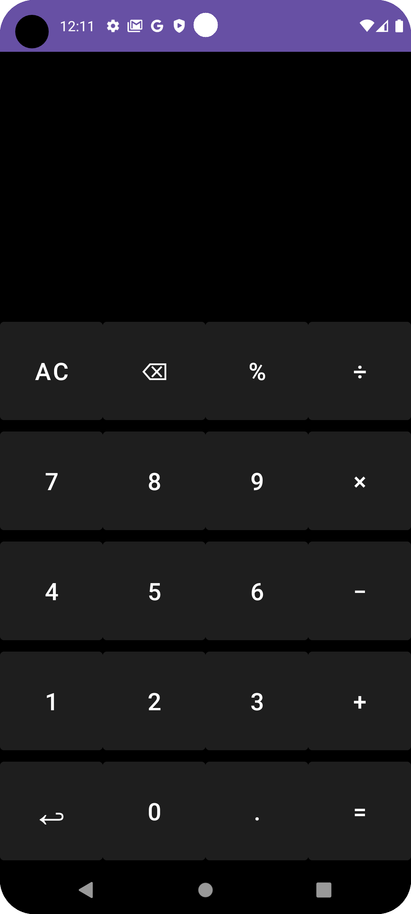
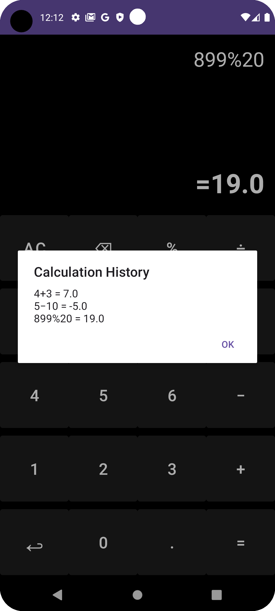
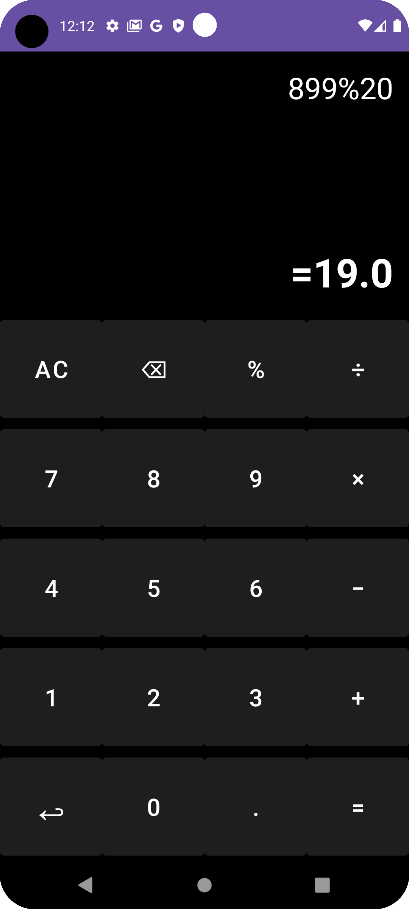

# 📱 Simple Calculator App (Kotlin & XML)

A user-friendly **Calculator App** built using **Kotlin & XML** with **History Feature**.

## 🚀 Features
✔ **Basic Arithmetic Operations** (Addition, Subtraction, Multiplication, Division, Modulus)  
✔ **History Feature** (Stores the last 10 calculations)  
✔ **Intuitive UI** (Material Design with a Back Arrow for History)  
✔ **Error Handling** (Prevents crashes on invalid inputs)  

## 📸 Screenshots
| Home Screen | History Feature | Screen |
|-------------|----------------|----------------|
|  |  |  |

## 📜 Installation
1. Clone the repository:
   ```sh
   git clone https://github.com/Fardhin/Calculator-using-kotlin.git
   ```
2. Open the project in **Android Studio**.
3. Click **Run** ▶ to launch the app.

## 🛠 Built With
- **Kotlin**
- **XML (UI)**
- **Android Studio**
- **Expression Evaluator (exp4j)**

## 🤝 Contribution
Feel free to fork the project, create a new branch, and submit a **Pull Request**.

## 📩 Contact
🔹 GitHub: [Fardhin](https://github.com/Fardhin)  
🔹 Email: shaikfarin1@gmail.com  

---
